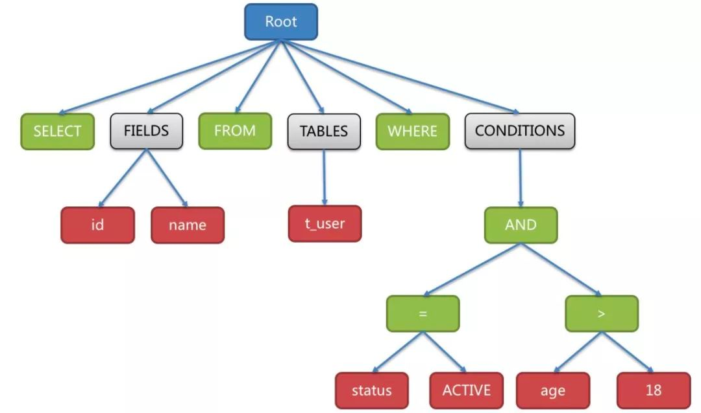

语法解析器每次从词法解析器中获取一个词法单元。如果满足规则，则继续下一个词法单元的提取和匹配，直至字符串结束；若不满足规则，便提示错误并结束本次解析。

语法解析难点在于规则的循环处理以及分支选择，还有递归调用和复杂的计算表达式等。

在处理循环规则时，当匹配完成一个规则时，匹配规则需要循环地再次匹配当前规则，当其不再是当前的规则定义时，才可以继续进行后续规则的匹配。以CREATE TABLE语句为例。每张表可以包含多列，每个列都可能需要定义名称、类型、精度等参数。

当一个规则中存在多条分支路径时，则需要超前搜索，语法解析器必须和每个可能的分支进行匹配来确定正确的路径。以ALTER TABLE语句为例。

修改表名语法为：

ALTER TABLE oldTableName RENAME TO newTableName;

删除列的语法为：

ALTER TABLE tableName DROP COLUMN columnName;

两个语句均以ALTER TABLE开头，它们合并在一起的语法为：

ALTER TABLE tableName (RENAME TO newTableName | DROP COLUMN columnName);

匹配完成tableName之后的2个分支选项，需要超前搜索来确定正确的分支。

在选择分支时，可能会出现一个分支是另一个分支的子集。此时，当成功匹配短路径时，需要进一步匹配长路径，在无法匹配长路径时，再选取短路径，这称之为贪婪匹配。如果不使用贪婪匹配的算法，则最长的分支规则便永远不能被匹配了。

当词法单元不满足一个可选规则时，则需要与下个规则做匹配，直至匹配成功或与下个非可选规则匹配失败。在CREATE TABLE语句中，定义列时存在很多可选项，比如是否为空、是否主键、是否存在约束条件等。

语法解析器最终将SQL转换为抽象语法树。例如以下SQL：

SELECT id, name FROM t_user WHERE status = 'ACTIVE' AND age > 18

解析之后的为抽象语法树见下图：

为了便于理解，抽象语法树中的关键字的Token用绿色表示，
变量的Token用红色表示，灰色表示需要进一步拆分。

语法解析要比词法解析复杂一些，词法解析的规则相对简单，
定义好词法单元的规则即可，极少出现分支选择；
而且只需超前搜索一个字符即可确定词法单元。
但它却是解析的基础，如果分词出现错误，语法解析则很难正确处理。

生成抽象语法树的第三方工具有很多，ANTLR是不错的选择。
它将开发者定义的规则生成抽象语法树的Java代码并提供访问者接口。
相比于代码生成，手写抽象语法树在执行效率方面会更加高效，
但是工作量也比较大。在性能要求高的场景中，可以考虑定制化抽象语法树。
